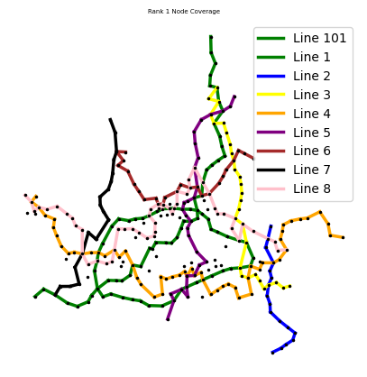
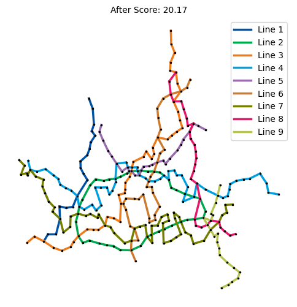

# Results

실험을 새로 실행한 결과가 아닙니다. 원본 notebook의 저장된 텍스트 출력을 [verified_outputs.md](verified_outputs.md)에 기록했습니다. 최종 최적해, 실제 운영 개선율 또는 원래 지하철 대비 성능 수치는 확인되지 않았습니다.

아래 그림은 원본 notebook의 저장된 PNG를 그대로 추출했습니다. 시각적으로 확인했으며 인명이나 로컬 경로는 없습니다. 공동 저작자의 공개 동의와 데이터 권한은 공개 전에 확인해야 합니다.

## Coverage candidate (original cell 26)

같은 셀의 저장 출력에서 최고 포함률은 91.32%, 미포함 노드는 25개입니다. 범례의 Line 101은 원본의 순환 경로 식별자 100을 표시하는 방식에서 나온 것으로 실제 101호선이 아닙니다. 실제 서울 지하철 노선도가 아닌 후보 설계입니다.

## Angle-based improvement (original cell 32)

그림 제목의 20.17은 종합 적합도 점수입니다. 이 실험의 저장 텍스트는 18.31→20.17을 표시합니다. coverage 수치나 교통 성능 개선율로 해석할 수 없습니다.
